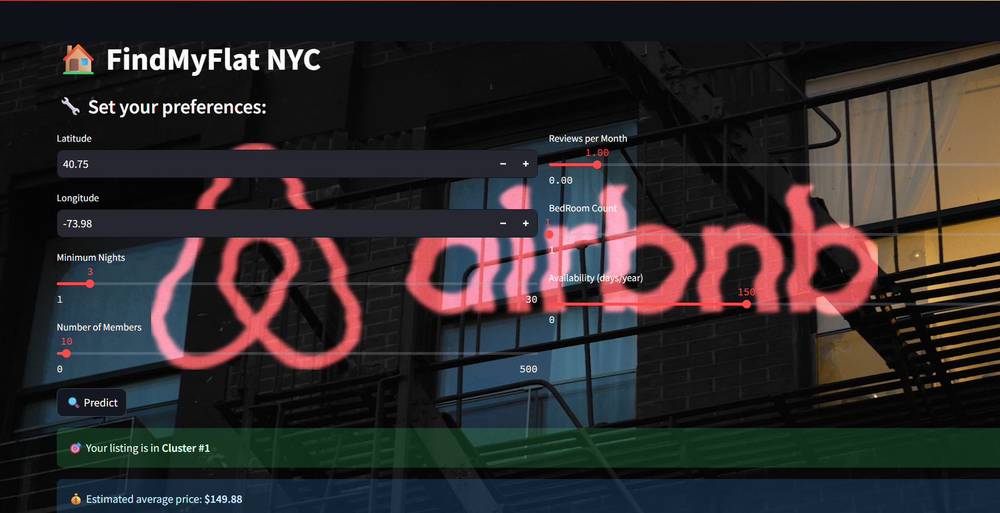
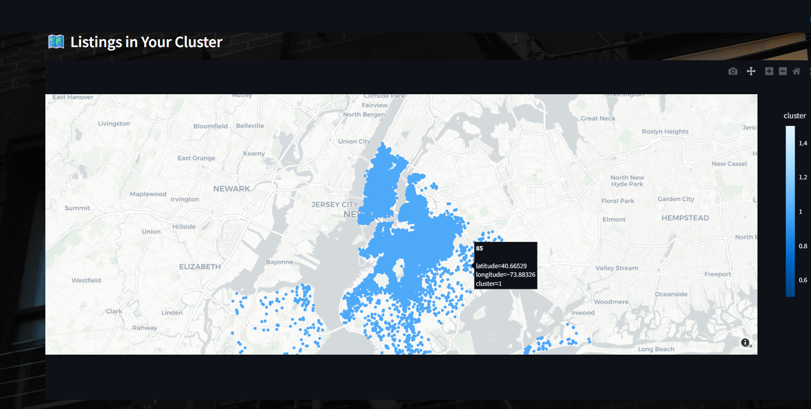

# 🏡 Airbnb App
 

This is a machine learning project that uses Streamlit to visualize Airbnb listings, cluster them, and predict prices.

## Features
- Unsupervised clustering
- Streamlit-based UI
- Price prediction
- Clean and user-friendly layout

## Screenshot




## How to Run

```bash
streamlit run ml_bnb.py

